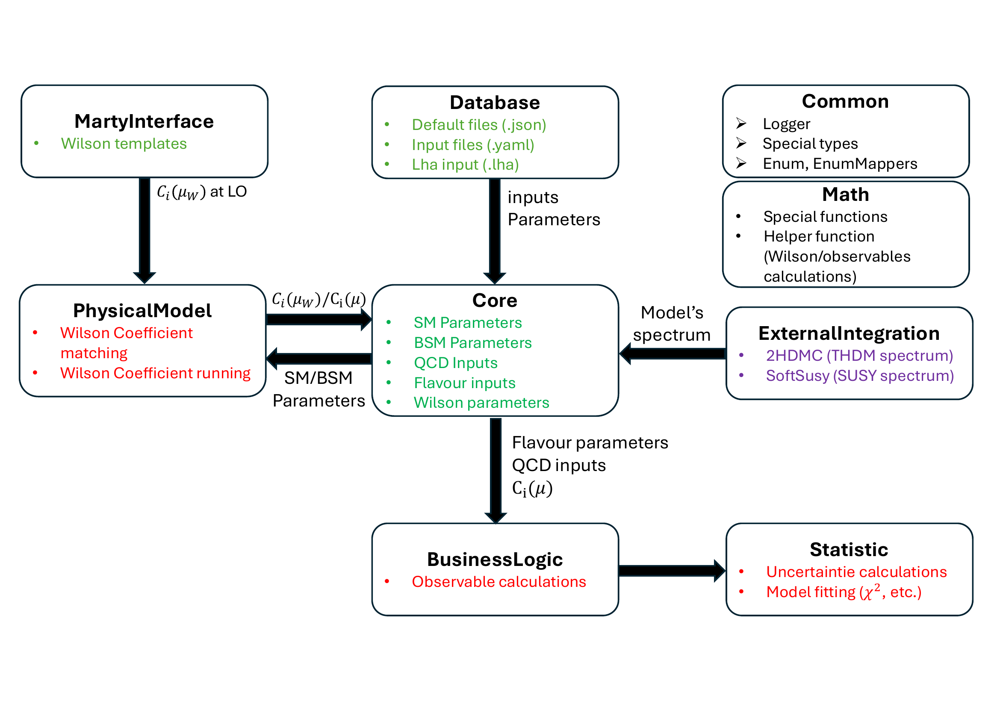

<div align="center">

# HyperIso

**A general BSM calculator for flavour observables, Wilson coefficients and statistical interpretation.**

[](https://isocpp.org/) [](https://pypi.org/project/pyhyperiso/) [](https://pypi.org/project/pyhyperiso/) [](https://github.com/HyperIso/HyperIso/actions/workflows/ci.yml) [](https://github.com/HyperIso/HyperIso/actions/workflows/python.yml) [](https://github.com/HyperIso/HyperIso/actions/workflows/docs.yml) [](https://github.com/HyperIso/HyperIso/actions/workflows/codeql.yml)

[](LICENSE) [](https://inspirehep.net/literature/3138024) [](https://securityscorecards.dev/viewer/?uri=github.com/HyperIso/HyperIso) [](CODE_OF_CONDUCT.md)

[Paper](https://inspirehep.net/literature/3138024) | [Documentation](docs/README.md) | [Examples](#examples) | [Contributing](CONTRIBUTING.md) | [Security](SECURITY.md)


</div>

---

## Overview

HyperIso is the evolution of the SuperIso flavour-physics calculator. It provides a modular C++ backend for Wilson-coefficient computation, flavour-observable prediction and statistical analysis, together with Python bindings, a command-line interface and a Dash graphical interface.

The main design goal is to make flavour observables usable beyond a fixed list of hard-coded models. HyperIso keeps native implementations for established scenarios such as the Standard Model, general Two-Higgs-Doublet Models and supersymmetric workflows, while using the MARTY framework to import leading-order BSM Wilson coefficients for arbitrary models.

HyperIso is intended for:

- phenomenological studies of BSM scenarios;
- Wilson-coefficient matching and running;
- computation of flavour observables in B, D and K sectors;
- statistical interpretation through uncertainty propagation, likelihoods and chi-square fits;
- scripted scans through Python;
- reproducible command-line workflows;
- exploratory use through the Dash GUI.

## Architecture

<p align="center">
  
</p>

The core pipeline separates model-independent infrastructure from model-specific physics:

| Module | Role |
|---|---|
| `Database` | Loads default JSON inputs, user YAML overrides and LHA/SLHA/FLHA files. |
| `Core` | Stores SM, BSM, QCD, flavour and Wilson parameters. |
| `MartyInterface` | Generates/imports Wilson-coefficient templates for arbitrary BSM models. |
| `PhysicalModel` | Performs Wilson-coefficient matching and running. |
| `BusinessLogic` | Computes physical observables from Wilson coefficients and input parameters. |
| `Statistic` | Computes uncertainties, likelihoods, chi-square values, fits and confidence regions. |
| `Math` | Provides special functions, integration helpers and numerical utilities. |
| `Common` | Defines shared types, mappers, enums, logging and identifiers. |
| `ExternalIntegration` | Interfaces optional tools such as 2HDMC and SoftSusy. |

All user-facing layers are designed to rely on the same backend initialization path, so C++, Python, CLI and GUI calculations remain consistent.

## Features

- Wilson-coefficient matching and running for supported flavour groups.
- Native SM, THDM and SUSY workflows, including higher-order QCD contributions where implemented.
- MARTY-based leading-order BSM Wilson-coefficient input for generic models.
- LHA, SLHA and FLHA-oriented input handling.
- JSON default database with YAML override layers.
- Observable calculations for a broad set of flavour processes.
- Statistical tools for uncertainty propagation, likelihood studies, chi-square fits and confidence contours.
- Python bindings via `pybind11`.
- Command-line summaries through `hyperiso-ui`.
- Dash GUI for interactive Wilson, observable, QCD and statistical workflows.
- Reproducibility-oriented examples for C++, Python and CLI users.

## Repository layout

```text
.
├── Assets/                         # Default inputs, templates, example LHA/SLHA/FLHA files
├── Hyperiso/
│   ├── Docs/                       # Doxygen configuration
│   └── Hyperiso/
│       ├── core/                   # C++20 backend and CLI source tree
│       ├── examples_cpp/           # C++ examples built against an installed HyperIso
│       ├── examples_python/        # Python examples using pyhyperiso
│       ├── pyhyperiso/             # Python package and high-level wrappers
│       └── pyproject.toml          # Python/scikit-build packaging entry point
├── GHyperiso/
│   └── HyperisoDashGUI/            # Dash graphical interface
├── docs/                           # User and developer documentation
├── docker/                         # Container build recipes
└── .github/                        # CI, templates, release and security automation
```

## Requirements

### Required for the C++ core

- Linux distribution with a recent GCC or Clang toolchain.
- CMake >= 3.20.
- C++20-capable compiler.
- GNU Scientific Library (GSL).
- Eigen 3.
- Ninja or Make.

### Required for Python

- Python 3.10–3.12.
- `pip`, `build`, `scikit-build-core`.
- `pybind11`.

### Optional backends

| Option | Purpose | CMake flag |
|---|---|---|
| MARTY | Generic BSM Wilson coefficients at leading order. | `-DBUILD_WITH_MARTY=ON` |
| 2HDMC | Bundled THDM spectrum support used by the THDM backend. | Built with the core. |
| SoftSusy | SUSY spectrum support. | `-DBUILD_WITH_SOFTSUSY=ON` |
| MinuitCpp | Bundled minimization backend used by statistical fits. | Built with the core. |

## Installation

### C++ core and CLI

```bash
git clone https://github.com/HyperIso/HyperIso.git
cd HyperIso

sudo apt-get update
sudo apt-get install -y build-essential cmake ninja-build libgsl-dev libeigen3-dev

cmake -S Hyperiso/Hyperiso/core -B build \
  -G Ninja \
  -DCMAKE_BUILD_TYPE=Release \
  -DBUILD_WITH_CLI=ON

cmake --build build -j
cmake --install build --prefix "$HOME/.local"
```

Add the install prefix to your environment if needed:

```bash
export PATH="$HOME/.local/bin:$PATH"
export CMAKE_PREFIX_PATH="$HOME/.local:$CMAKE_PREFIX_PATH"
```

### Python bindings

From the repository root:

```bash
python -m pip install --upgrade pip build
python -m pip install ./Hyperiso/Hyperiso
```

For editable development:

```bash
python -m pip install -e ./Hyperiso/Hyperiso
```

When the package is published, the intended PyPI command is:

```bash
python -m pip install pyhyperiso
```

## Quick start

### Python

```python
from pyhyperiso.Common import Model, QCDOrder, Observables
from pyhyperiso.Core import HyperisoConfig, HyperisoMaster
from pyhyperiso.Observable import ObservableInterface

config = HyperisoConfig(model=Model.SM)
hyp = HyperisoMaster()
hyp.init(lha_file="lha/si_input.flha", config=config)

obs = ObservableInterface()
obs.add_observable(Observables.BR_BS_MUMU, QCDOrder.NNLO)
print(obs.compute_observable(Observables.BR_BS_MUMU))
```

### C++

```cpp
#include <iostream>

#include "HyperisoMaster.h"
#include "Include.h"
#include "ObservableInterface.h"

int main() {
    HyperisoConfig config;
    config.model = Model::SM;

    HyperisoMaster hyp;
    hyp.init("Assets/lha/si_input.flha", config);

    ObservableInterface obs;
    obs.add_observable(Observables::BR_BS_MUMU, QCDOrder::NNLO);
    std::cout << obs.compute_observable(Observables::BR_BS_MUMU) << std::endl;
}
```

### CLI

```bash
hyperiso-ui wilson summary \
  --model SM \
  --lha Assets/lha/si_input.flha \
  --groups BCoefficients \
  --coeffs C7,C9,C10 \
  --qmatch 81 \
  --q 4.8 \
  --order NNLO
```

```bash
hyperiso-ui observable summary \
  --model SM \
  --lha Assets/lha/si_input.flha \
  --observables BR_Bs__mu_mu,BR_B__Xs_gamma \
  --order NNLO
```

### Dash GUI

```bash
cd GHyperiso/HyperisoDashGUI
python -m pip install -r requirements.txt
python app.py
```

Open `http://127.0.0.1:8050` in a browser.

## Examples

| Directory | Description |
|---|---|
| `Hyperiso/Hyperiso/examples_cpp/Core` | Initialization, parameter access, block inspection and QCD helpers. |
| `Hyperiso/Hyperiso/examples_cpp/Wilson` | Wilson-coefficient matching/running, MARTY workflows and custom groups. |
| `Hyperiso/Hyperiso/examples_cpp/Observable` | Observable calculations, binned observables and scans. |
| `Hyperiso/Hyperiso/examples_cpp/Statistic` | Uncertainty propagation, likelihood scans and confidence contours. |
| `Hyperiso/Hyperiso/examples_python` | Python equivalents of the public workflows. |
| `GHyperiso/HyperisoDashGUI` | Interactive Dash workflows. |

The examples are intended to double as smoke tests and reproducibility assets for the paper. See the README files in each examples directory for details.

## Testing

### C++ tests

```bash
cmake -S Hyperiso/Hyperiso/core -B build \
  -G Ninja \
  -DCMAKE_BUILD_TYPE=Debug \
  -DENABLE_TESTS=ON

cmake --build build -j
ctest --test-dir build --output-on-failure
```

Run only one family of tests:

```bash
ctest --test-dir build -L common --output-on-failure
ctest --test-dir build -L statistic --output-on-failure
ctest --test-dir build -L physicalmodel --output-on-failure
```

Heavy numerical comparison tests are opt-in:

```bash
cmake -S Hyperiso/Hyperiso/core -B build-comparison \
  -DENABLE_TESTS=ON \
  -DHYPERISO_BUILD_COMPARISON_TESTS=ON
```

### Python tests

```bash
python -m pip install -e "./Hyperiso/Hyperiso[test]"
python -m pytest Hyperiso/Hyperiso/pyhyperiso/test
```

## Reproducibility

The repository includes a frozen reproducibility package for the calculations shown in the paper. It contains:

- input LHA/SLHA/FLHA files;
- exact commands;
- expected numerical outputs;
- frozen numerical references and SHA-256 provenance metadata;
- a strict checker and scripts to regenerate the five reference cases.

Validate the frozen references with:

```bash
python reproducibility/scripts/check_expected_outputs.py \
  --manifest reproducibility/manifest.json \
  --outputs reproducibility/expected_outputs \
  --expected reproducibility/expected_outputs
```

See `docs/reproducibility.md` for the complete workflow.

## Documentation

- User documentation: `docs/README.md`
- C++ API documentation: generated with Doxygen from `Hyperiso/Docs/Doxyfile`
- C++ examples: `Hyperiso/Hyperiso/examples_cpp/README.md`
- Python examples: `Hyperiso/Hyperiso/examples_python/README.md`
- CLI guide: `Hyperiso/Hyperiso/core/src/UserInterface/README.md`
- Known limitations: `KNOWN_LIMITATIONS.md`
- Dash GUI guide: `GHyperiso/HyperisoDashGUI/README.md`

Build the C++ API documentation locally:

```bash
doxygen Hyperiso/Docs/Doxyfile
```

## Containers

A development image is provided in `docker/Dockerfile`:

```bash
docker build -f docker/Dockerfile -t hyperiso:dev .
docker run --rm hyperiso:dev hyperiso-ui --help
```

Run the Dash GUI through Compose:

```bash
docker compose up --build hyperiso-dash
```

## Quality and security automation

The `.github` configuration includes professional automation for:

- C++ CI with GCC and Clang;
- Python package tests;
- documentation builds;
- Docker builds;
- CodeQL analysis;
- OpenSSF Scorecard;
- release packaging;
- Dependabot updates;
- issue and pull-request templates.

Future hardening work is tracked as roadmap work and is not presented as part of the 1.0.0 release guarantees.

## Citation

If you use HyperIso in scientific work, please cite the paper and the software release:

- HyperIso paper record: https://inspirehep.net/literature/3138024
- Software citation metadata: `CITATION.cff`

BibTeX will be added here once the publication metadata is final.

## Contributing

Contributions are welcome. Please read:

- `CONTRIBUTING.md` for development, style and testing guidelines;
- `CODE_OF_CONDUCT.md` for community standards;
- `SECURITY.md` for vulnerability reporting.

## License

The combined HyperIso distribution is released under the GNU General Public
License, version 3 or later. HyperIso-authored portions originally published
under MIT retain their MIT grant. See `LICENSE`, `LICENSES/` and
`THIRD_PARTY_NOTICES.md` for component-level details.
